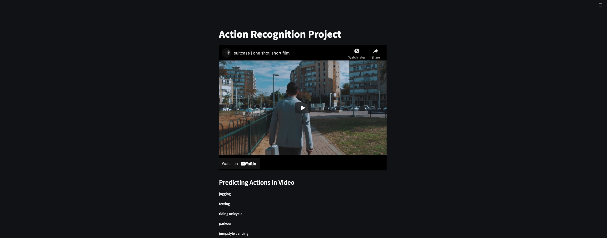
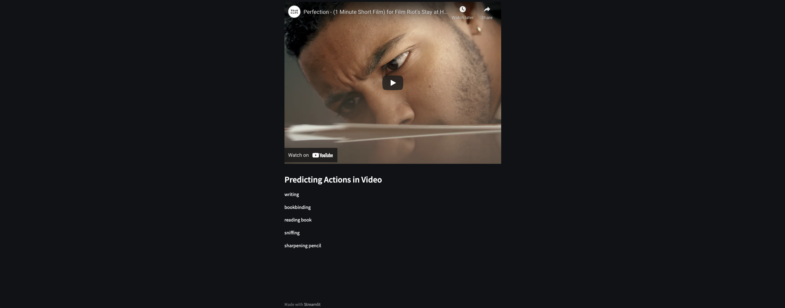

# CMPE-258-Sec-49-Deep-Learning-Project

Google Drive with Project Demo Video, Presentation, Model Artifacts and MLOPS Experiments - https://drive.google.com/drive/folders/1BBtNbZ0F7RtKKbaVecweYDlJ87bD4ZCC?usp=sharing

### About Team
#### Team Name - Insomniacs
#### Team Members 
1. Aryan Jadon ( 015260609 )
2. Swathi Anandram  (015923804)
3. Weifeng Ma (011072867)

### Project Folder Description
1. app_screenshots - folder containing app screenshots
2. ml_flow - folder containing MLOPS Experiment tracking CSV Files and Screenshots
3. model_weights - Model Artifacts and Model Weights trained using Google Colab
4. notebooks - folder containing model notebooks - CNN, CNN-RNN, Transformers and MMAction
5. test_videos - folder containing videos from youtube predicted in Streamlit App

### Google Colab Links 
1. Classification using CNN Google Colab Link - https://colab.research.google.com/drive/1w_hkb2e0aUylDBT0Cp8ix7eYsL19Ugb9?usp=sharing
2. Classification using CNN-RNN Google Colab Link - https://colab.research.google.com/drive/1o-EUWEK1Z19YnVuolLRrbw8le3P0WuHy?usp=sharing
3. Classification using Transformers Google Colab Link - https://colab.research.google.com/drive/1jYU1U1Qdunb3xzZBN8qGl5CPl869BF5o?usp=sharing
4. Classification using MMAction - https://colab.research.google.com/drive/1Jn-NVj7DopdwC3lukRuhE_lf2eMNkC6K?usp=sharing

### Action Recognition APP Screenshots - Deployed Using Streamlit
Screenshot 1

Screenshot 2

#### Run Project
1. install all dependencies using requirements.txt - pip install -r requirementx.txt
2. streamlit run app.py

Live Streamlit App Deployed on- https://share.streamlit.io/aryan-jadon/deep-learning-deployment/main/app.py

Caution - App will Take Some Time to Load on Streamlit Live Server